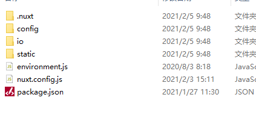

# nebula

# vertical-ui

## 开发计划
## 已完成
- [x] 首页  
- [x] 会员登录/注册
- [x] 文章发布/编辑/详情/删除
- [x] 个人主页
- [x] 找回密码
- [x] 用户管理  
- [x] 角色/权限管理 (2019/12/05 21:52 更新)  
- [x] 专题管理 (2019/12/05 21:52 更新)  
- [x] 标签管理 (2019/12/26 00:11 更新)   
- [x] 专题-标签管理 (2019/12/26 00:11 更新)    
- [x] 用户-标签管理 (2019/12/26 00:11 更新)    
- [x] 个人信息修改 (2020/01/09 14:20 更新)   
- [ ] 消息系统  
  - [x] 系统公告 (2020/03/12 14:20 更新) 
  - [x] 回帖提醒 (2020/03/12 14:20 更新) 
  - [ ] 关注提醒 (2020/03/12 14:20 更新) 
- [x] 评论系统 (2020/03/12 14:20 更新)   
- [x] 我的草稿 (2020/03/16 00:20 更新)     
- [x] 分享功能  
   - [x] 分享链接 (2020/03/16 12:20 更新)     
   - [x] 分享至微信 (2020/03/16 12:20 更新)      
- [x] 作品集功能 (2020/04/14 21:20 更新)
- [x] SEO 优化
## 待完成
- [ ] 关注功能
  - [ ] 关注用户
  - [ ] 关注文章
  - [ ] 关注主题
  - [ ] 关注标签
- [ ] 数据统计   
- [ ] 专题面板
- [ ] 标签面板
- [ ] 作品集生成电子书
## 构想
- [ ] 专业知识题库
- [ ] 社区贡献系统
- [ ] 会员系统
- [ ] 勋章系统

## Build Setup

```bash
# install dependencies
$ npm install

# serve with hot reload at localhost:3000
$ npm dev

# build for production and launch server
$ npm build
$ npm start

# generate static project
$ npm generate
```

## 项目部署
1. 控制台执行 `npm run build`
2. 拷贝以下文件至服务器

   
3. 服务器安装 `Nodejs` 环境
4. 项目目录下执行 `npm install`
5. 执行 `npm install pm2 -g`
6. 执行 `pm2 list` 检查 `pm2` 是否安装好
7. 执行 `pm2 start npm --name "nebula" -- run start --watch`


For detailed explanation on how things work, check out [Nuxt.js docs](https://nuxtjs.org).
